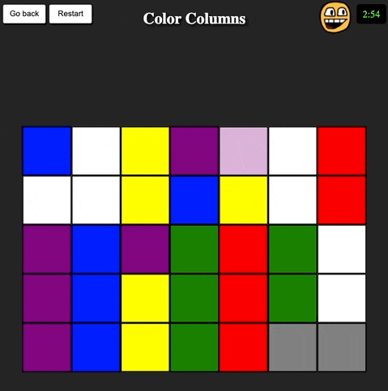

## Color Columns Game

Funny quiz game developed with pure React 18, zero external libraries. (It uses Parcel as its web application bundler; SCSS as its style processor and uses Typescript for types and interfaces.)

This development was born because of a challenge for the RandLabs company. It was developed on three days, using latest React practices.

It has a 90%+ coverage of unit tests made with react-testing-library and Jest.

It's hosted on a github page [available to play here](https://valentinoconti.github.io/colorColumns/). Enjoy!

